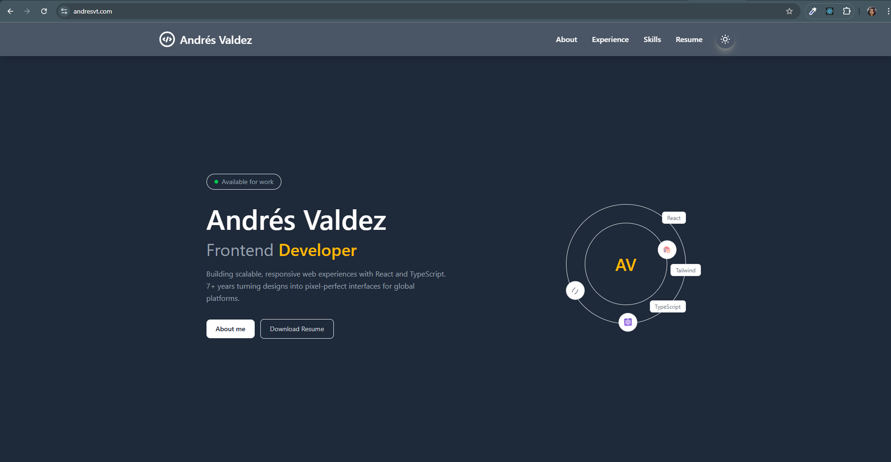

# Andrés Valdez — Personal Portfolio

A responsive personal portfolio website built with React and Tailwind CSS, showcasing my professional experience, skills, and projects as a Frontend Developer.

🌐 **Live site:** [andresvt.com](https://andresvt.com)

---

## Screenshot



---

## Features

- ⚡ Fast and lightweight — built with Vite
- 🌗 Dark / Light mode toggle with persistent preference
- 🎞️ Smooth animations powered by Framer Motion
- 📱 Fully responsive design with a mobile-friendly animated menu
- 🔗 Smooth scroll navigation between sections
- 📄 Downloadable CV

---

## Sections

- **Hero** — Introduction, CTAs and social links
- **About** — Professional summary, education and contact info
- **Experience** — Work history with detailed descriptions
- **Skills** — Technical skills overview
- **Resume** — Downloadable CV

---

## Tech Stack


---

## Getting Started

### Prerequisites

- Node.js 18+
- npm or yarn

### Installation

1. Clone the repository:
```bash
git clone https://github.com/andresvaldezt/portfolio-vite-react.git
cd portfolio-vite-react
```

2. Install dependencies:
```bash
npm install
```

3. Start the development server:
```bash
npm run dev
```

4. Open [http://localhost:5173](http://localhost:5173) in your browser.

---

## Project Structure

```
src/
├── assets/          # Images, CV and static files
├── components/      # Reusable components (Header, Footer, etc.)
├── context/         # Theme context provider
├── pages/           # Page components (Home, 404)
└── main.jsx         # App entry point
```

---

## Deployment

This site is deployed on **Netlify** with a custom domain. Every merge to `main` triggers an automatic deployment.

---

## License

This project is open source and available under the [MIT License](LICENSE).

---

## Contact

**Andrés Valdez** — [andres.valdez.t@gmail.com](mailto:andres.valdez.t@gmail.com)

[](https://github.com/andresvaldezt)
[](https://andresvt.com)